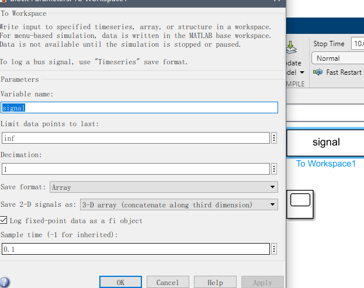

# Python 与 Simulink联合仿真

## 1. Python安装Matlab拓展环境

找到matlab的安装目录，进入`extern/engines/python`目录，在此目录中输入`cmd`调出命令行。


随后创建python虚拟环境，其中python的版本要根据使用的matlab版本来设定。我们可以在matlab的帮助文档中进行查询


可以看到2021b版本是支持3.7，3.8，3.9三个版本的python的，使用conda安装（如没有conda的可以在电脑上先安装anaconda或miniconda，也可以使用其他虚拟环境工具），以python3.7为例。

```
conda create -n <env_name> python==3.7
```

创建完虚拟环境之后，进入虚拟环境（假设环境名为`matlab`）

```
conda activate matlab
```

当前我们已经在`extern/engines/python`了，可以看到这个文件夹里面看到有`setup.py`这个文件，这个文件就是matlab engine的安装程序。继续输入命令

```
python setup.py install
```

安装完成之后可以在命令行中输入`pip list`查看是否安装完成


可以看到，我们已经安装好了python的matlab engine（这里我们用的是2019b版本）。

## 2. Matlab命令行控制Simulink

建立我们的工程文件夹，随后将其添加至matlab路径。这里我们搭建了一个简单的模型


随后我们可以利用matlab中输入命令控制simulink，这里我们做一个简单的取值。

[利用m文件运行初始化](start_model_using_m.m)

在python中可以通过调用m文件来间接对simulink进行控制

[python调用m文件](run_m_python.py)

## 3. Python直接调用Simulink

以上方法是以m文件作为中介来控制Simulink，操作起来有以下问题：

1. 需要同时编写m文件和python文件，各类变量需要定义明确，操作多有不便；

2. 上述的方法在遇到较大的工程时，如果用变步长进行step出现步长时间步长不一致的情况。

所以我们可以使用Python直接对Simulink进行控制，首先配置模型。


在Assertion中输入回调函数

```matlab
set_param(bdroot, 'SimulationCommand', 'pause')
```

表示当Assertion执行时，暂停Simulink。

**note：**`Stop simulation when assertion fails`要取消勾选，否则在运行过程中会直接退出。

在我们需要观测的数据示波器中配置回调函数


```matlab
open_system(gcbh);
```

设置采样步长为0.1



随后运行编写完成的python文件

[python直接调用Simulink](run_simulink_python.py)

可以得到以下效果


